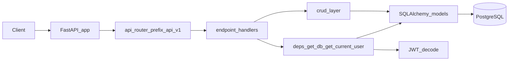

# FastAPI Recipe API

This project is a **FastAPI** REST API for recipes with **JWT** authentication, **SQLAlchemy** persistence on **PostgreSQL**, and **Alembic** migrations. API responses use a shared **Pydantic** envelope for consistent JSON across success and error paths.

---

## Architecture

The code is organized in layers: HTTP routing and validation sit above CRUD and SQLAlchemy models. Cross-cutting concerns (settings, database session, security, exception formatting) live under `app/core`.

| Layer | Location | Role |
|--------|-----------|------|
| Entry | [`app/main.py`](app/main.py) | Builds the `FastAPI` app, enables pagination, calls `Base.metadata.create_all`, mounts routes at `/api/v1`, registers HTTP and validation exception handlers |
| API | [`app/api/v1/api.py`](app/api/v1/api.py) | Composes routers: `/auth`, `/recipes` |
| Endpoints | [`app/api/v1/endpoints/auth.py`](app/api/v1/endpoints/auth.py), [`app/api/v1/endpoints/recipe.py`](app/api/v1/endpoints/recipe.py) | Route handlers; invoke CRUD; return `APIResponse[...]` |
| Dependencies | [`app/api/deps.py`](app/api/deps.py) | `get_db` (SQLAlchemy session per request), `get_current_user` (JWT validation and user lookup) |
| CRUD | [`app/crud/auth.py`](app/crud/auth.py), [`app/crud/recipe.py`](app/crud/recipe.py) | Database read/write helpers used by endpoints |
| Persistence | [`app/models/auth.py`](app/models/auth.py), [`app/models/recipe.py`](app/models/recipe.py) | SQLAlchemy ORM models (tables) |
| Cross-cutting | [`app/core/config.py`](app/core/config.py), [`app/core/database.py`](app/core/database.py), [`app/core/security.py`](app/core/security.py), [`app/core/exceptions.py`](app/core/exceptions.py) | Environment-based settings, engine and sessions, password hashing and JWT, unified error JSON |



Protected recipe routes depend on `get_current_user`: the client sends a **Bearer** token; [`OAuth2PasswordBearer`](app/core/security.py) supplies the token string; [`get_current_user`](app/api/deps.py) decodes the JWT and loads the `User` from the database.

---

## Pydantic schemas

**Schemas** (`app/schemas/`) define the API contract: request bodies, response shapes, and validation rules. They are separate from **SQLAlchemy models** (`app/models/`), which map to database tables.

| Module | Purpose |
|--------|---------|
| [`app/schemas/response.py`](app/schemas/response.py) | Generic `APIResponse[T]` with `status`, `message`, `is_error`, and optional `data`. Success handlers and [`custom_http_exception_handler` / `validation_exception_handler`](app/core/exceptions.py) use this shape so clients always get the same top-level fields. |
| [`app/schemas/auth.py`](app/schemas/auth.py) | `UserCreate` (username, phone, email, password rules, confirm password), `UserLoginRequest`, `UserResponse` (includes `access_token` after login). |
| [`app/schemas/recipe.py`](app/schemas/recipe.py) | `RecipeCreate` / `RecipeBase`, `RecipeResponse` (ORM-friendly via `Config` / `from_attributes`), `RecipeUpdate` for partial updates. |

**Ingredients storage:** the API exposes `ingredients` as a list of strings in Pydantic, while the [`Recipe`](app/models/recipe.py) model stores `ingredients` as text (JSON serialized). Endpoints serialize on write and use `json.loads` when reading so responses match `RecipeResponse`.

---

## Database

- **Connection:** [`app/core/database.py`](app/core/database.py) creates a SQLAlchemy `engine` from `DATABASE_URL` in settings and a `SessionLocal` factory for request-scoped sessions.
- **Tables:**
  - **`users`** — UUID primary key, unique `user_name` and `email`, phone fields, `hashed_password`, soft-delete flag [`User`](app/models/auth.py).
  - **`recipes`** — UUID primary key, title, description, ingredients, instructions, optional `cooking_time` / `servings`, `user_id` foreign key to `users.id`, timestamps, `is_deleted` for soft delete [`Recipe`](app/models/recipe.py).
- **Startup:** [`app/main.py`](app/main.py) calls `Base.metadata.create_all(bind=engine)`, which creates missing tables on startup (useful for local development).
- **Migrations:** [Alembic](alembic/) tracks schema changes over time. [`alembic/env.py`](alembic/env.py) sets `sqlalchemy.url` from `settings.DATABASE_URL`. For production, prefer applying revisions under `alembic/versions/` rather than relying only on `create_all`.
- **Alembic autogenerate:** `target_metadata` in `env.py` is currently `None`, so `alembic revision --autogenerate` does not pick up models until you point `target_metadata` at `Base.metadata` (optional improvement).

**Configuration:** [`app/core/config.py`](app/core/config.py) loads `DATABASE_URL`, `SECRET_KEY`, `ALGORITHM`, and `ACCESS_TOKEN_EXPIRE_MINUTES` from a `.env` file via `pydantic-settings`.

---

## Dependencies (packages and why)

There is no `requirements.txt` in this repository; install the packages your code imports. Summary:

| Package | Why it is used |
|---------|----------------|
| **fastapi** | Application framework, routing, dependency injection, `OAuth2PasswordBearer` |
| **uvicorn** | ASGI server to run the app |
| **sqlalchemy** | ORM: engine, `Session`, declarative `Base`, column types including PostgreSQL `UUID` |
| **psycopg2-binary** | PostgreSQL DBAPI driver (for `DATABASE_URL` such as `postgresql://...`) |
| **pydantic** | Request/response models and validation (`Field`, `EmailStr`, validators) |
| **pydantic-settings** | `BaseSettings` to load `.env` into [`Settings`](app/core/config.py) |
| **email-validator** | Required for Pydantic `EmailStr` on user registration |
| **passlib** and **bcrypt** | Password hashing via `CryptContext` in [`app/core/security.py`](app/core/security.py) |
| **python-jose** | JWT encoding and decoding in security and [`app/api/deps.py`](app/api/deps.py) |
| **alembic** | Database migrations; env reads the same `DATABASE_URL` as the app |
| **fastapi-pagination** | Paginated recipe listing (`Page`, `Params`) in [`recipe` endpoints](app/api/v1/endpoints/recipe.py) |

**Not required for current JSON APIs:** `python-multipart` is only needed for `multipart/form-data` (for example file uploads). This project does not use that in the codebase.

---

## Environment variables

Create a `.env` file in the project root (see [`app/core/config.py`](app/core/config.py)):

| Variable | Purpose |
|----------|---------|
| `DATABASE_URL` | SQLAlchemy URL for PostgreSQL |
| `SECRET_KEY` | Symmetric key for signing JWTs |
| `ALGORITHM` | JWT algorithm (for example `HS256`) |
| `ACCESS_TOKEN_EXPIRE_MINUTES` | Access token lifetime in minutes |

Generate a secret key:

```bash
openssl rand -hex 32
```

---

## Setup

### 1. Create and activate a virtual environment

```bash
python3 -m venv recipe_venv
source recipe_venv/bin/activate
```

### 2. Install dependencies

```bash
pip install fastapi "uvicorn[standard]" sqlalchemy psycopg2-binary
pip install pydantic pydantic-settings email-validator
pip install passlib "bcrypt==4.0.1" "python-jose[cryptography]"
pip install alembic fastapi-pagination
```

Use a `bcrypt` version compatible with `passlib` (for example `4.0.1` as above).

---

## Run the application

From the **repository root** (so the `app` package resolves):

```bash
uvicorn app.main:app --reload
```

---

## Database migrations (Alembic)

Alembic is already configured in this repo. Typical workflow:

```bash
# Create a new revision (after you change models or env metadata)
alembic revision -m "your message"

# Apply migrations to head
alembic upgrade head
```

---

## Notes

- Activate the virtual environment before installing or running.
- Keep `SECRET_KEY` and `.env` out of version control.
- After changing SQLAlchemy models, create and apply Alembic revisions for production; `create_all` alone does not alter existing columns.
